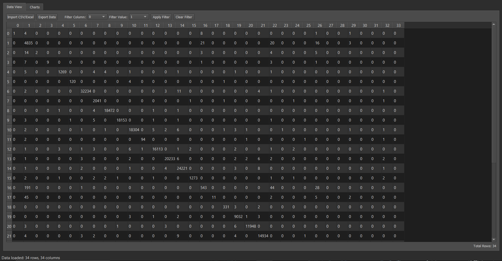
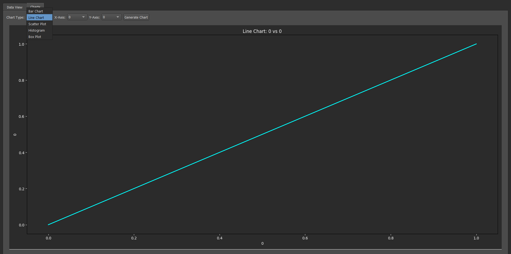

---

# Data Science Dashboard (PyQt5 + Pandas)

A modern **Data Analytics & Visualization Desktop Application** built using **Python, PyQt5, and Pandas**.
It allows users to **import, explore, filter, and visualize** CSV/Excel data interactively — designed with a **Data Science–inspired modern dark UI**.

---

## Features

 **CSV & Excel Import** – Load datasets easily using a file dialog
 **Interactive Data View** – View and sort data with `QTableView`
 **Column Filters** – Filter data dynamically by column values
 **Data Statistics** – View dataset insights like rows, columns, and datatypes
 **Graph Visualization** – Generate plots (line, bar, scatter, histogram)
 **Data Cleaning Tools** – Handle missing values and basic transformations *(optional feature section)*
 **Modern Dark UI** – Inspired by data science dashboards and analytics platforms
 **Responsive Tabs Layout** – Split view for data, charts, and logs

---

## Tech Stack

| Layer                        | Technology                 |
| :--------------------------- | :------------------------- |
| **Frontend (UI)**            | PyQt5                      |
| **Backend (Logic)**          | Python 3.x                 |
| **Data Handling**            | Pandas                     |
| **Visualization (optional)** | Matplotlib / Seaborn       |
| **UI Theme**                 | Custom Dark Fusion Palette |

---

##  Interface Preview

<table align="center"> 
    <tr>
        <td align="center"> 
            <br/> 
            <b>Dashboard Overview</b> 
        </td> 
        <td align="center"> 
            <br/> 
            <b>Chart Visualization Tab</b> 
        </td> 
    <tr> 
</table>

```
 Load File   →   Visualize Data  →   Filter Columns  →   View Statistics
```

---

## Installation

### Clone the Repository

```bash
git clone https://github.com/DevilEye007/Data-Analytics-Dashboard.git
cd data-science-dashboard
```

### Install Dependencies

```bash
pip install -r requirements.txt
```

---

## Run the App

```bash
python main.py
```

---

## Folder Structure

```
 Data-Science-Dashboard
 ┣ 📜 main.py                # Main application
 ┣ 📜 README.md              # Documentation
 ┗ 📜 requirements.txt       # Dependencies
```

---

## Future Enhancements

* Machine Learning Model Integration (Regression / Classification)
* Auto Data Profiling using Pandas-Profiling
* Cloud Data Import (Google Sheets, SQL)
* AI-Powered Insights & Anomaly Detection

---

## Author

**Faizan Sultan**
IT Student | Data Science & Python Developer
Pasrur, Punjab
[LinkedIn](https://www.linkedin.com/in/faizan-sultan-302b1b24b) • [GitHub](https://github.com/DevilEye007)

---

## License

This project is licensed under the **MIT License** — feel free to use, modify, and distribute it.

---